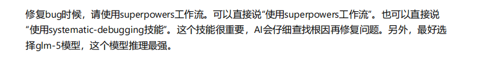

# 敏捷开发 + Superpowers AI工作流

---

## 插件概述

之前说过 **skill**、**AGENTS.md** 还有 **MCP**。

**插件 = 整合所有配置的完整方案**

插件可以包含：
- Skills（技能/工作流）
- AGENTS.md（项目指令文件）
- MCP配置（外部工具连接）
- 其他项目配置

---

## Harness 概念

### 什么是 Harness？

Harness 本意是"驾驭"或"骑马"的动词。

**AI类比**：AI是能力强大的马，人需要用工程配置去"驾驭"它。

### 为什么需要 Harness？

| 问题 | 解决 |
|------|------|
| AI输出不稳定 | 工作流约束行为 |
| AI容易跑偏 | 阶段性检查点 |
| AI缺乏上下文 | 配置文件提供指令 |
| AI无法调用工具 | MCP扩展能力 |

**Superpowers插件** = 一个非常有效的AI流程控制Harness

---

## 敏捷开发回顾

### 什么是敏捷开发？

几年前开始流行的软件开发方法论。

**核心问题**：软件工程经常面对需求变更，代码修改频繁，如何确保系统健壮性和可维护性？

### 敏捷核心原则

1. **迭代开发** - 小步快跑，持续交付
2. **响应变化** - 欢迎需求变更
3. **团队协作** - 每日沟通，透明进度
4. **持续改进** - 定期复盘，优化流程

---

## Sprint 简介

### 什么是 Sprint？

Sprint = 敏捷开发中的"冲刺周期"

通常是 **1-2周** 的固定开发周期。

### Sprint 结构

```
┌─────────────────────────────────────────────┐
│                  Sprint                      │
├─────────┬─────────┬─────────┬───────────────┤
│ 需求分析 │ 方案设计 │ 开发实现 │ 测试验收      │
│ Day 1   │ Day 1-2 │ Day 2-5 │ Day 5-结束    │
└─────────┴─────────┴─────────┴───────────────┘
                    ↓
              Sprint复盘 → 下一个Sprint
```

### Sprint 目标

- 明确范围：只做计划内的事
- 可交付成果：Sprint结束必须有可测试的成果
- 快速反馈：尽早发现问题

---

## 测试驱动开发 (TDD)

### TDD 定义

**先写测试，再写代码让测试通过**

### Red-Green-Refactor 循环

```
     ┌───────┐
     │  Red  │ ← 写一个失败的测试
     └───┬───┘
         ↓
     ┌───────┐
     │ Green │ ← 写最少代码让测试通过
     └───┬───┘
         ↓
     ┌─────────┐
     │ Refactor│ ← 重构代码，保持测试通过
     └─────────┘
         ↓
     (重复)
```

### TDD 好处

| 好处 | 说明 |
|------|------|
| **需求对齐** | 测试写完 = 需求确定 |
| **测试防护网** | 提供修改保障，支持重构 |
| **设计驱动** | 先思考接口，后实现细节 |
| **文档作用** | 测试即行为文档 |

### 为什么AI Harness都用TDD？

AI写代码成本低，在有测试防护网的前提下：
- 可以轻易重构代码
- 可以安全扩展功能
- AI错误可以被测试捕获

---

## Superpowers 工作流

### Superpowers 是什么？

一整套让AI从**需求分析**到**测试驱动开发**的完整工作流。

内部由多个互相串联的skill组成。

### 技能调用关系

```
                              用户请求
                                 │
                                 ▼
                    ┌───────────────────────┐
                    │   using-superpowers   │
                    │     (入口判断)         │
                    └───────────┬───────────┘
                                │
              ┌─────────────────┼─────────────────┐
              ▼                 ▼                 ▼
    ┌─────────────────┐ ┌─────────────────┐ ┌─────────────────┐
    │  brainstorming  │ │  systematic-    │ │ test-driven-    │
    │   (创建功能)    │ │   debugging     │ │ development     │
    └────────┬────────┘ │   (修复Bug)     │ │  (实现功能)     │
             │          └─────────────────┘ └─────────────────┘
             ▼
    ┌─────────────────┐
    │  writing-plans  │
    │   (编写计划)     │
    └────────┬────────┘
             │
             ▼
    ┌─────────────────┐
    │ executing-plans │
    │   (执行计划)     │
    └────────┬────────┘
             │
             ▼
    ┌─────────────────────────────────────────────┐
    │              项目特定技能                    │
    │  ┌─────────────────┐ ┌─────────────────┐   │
    │  │ unity-mcp-      │ │ unity-test-     │   │
    │  │ helper          │ │ framework       │   │
    │  └─────────────────┘ └─────────────────┘   │
    └─────────────────────────────────────────────┘
```

### 核心技能说明

| 技能 | 用途 | 触发场景 |
|------|------|----------|
| **using-superpowers** | 入口判断 | 每次对话开始 |
| **brainstorming** | 头脑风暴/需求分析 | 创建新功能时 |
| **writing-plans** | 编写实现计划 | brainstorming后 |
| **executing-plans** | 执行实现计划 | 计划确认后 |
| **test-driven-development** | TDD流程 | 实现功能时 |
| **systematic-debugging** | 系统化调试 | 遇到Bug时 |

---

## Sprint 与 Superpowers 对照

### 一个Sprint ≈ 一个Superpowers循环

```
Sprint阶段              Superpowers技能
──────────────────────────────────────────
需求分析        →      brainstorming
方案设计        →      writing-plans
开发实现        →      executing-plans + TDD
测试验收        →      测试运行 + verification
Bug修复         →      systematic-debugging
复盘优化        →      receiving-code-review
```

---

## TDD 实践示例

### 示例场景：开发玩家移动功能

**Step 1: Red - 写失败测试**

```csharp
[Test]
public void Player_MoveRight_PositionChanges()
{
    var player = new Player();
    player.Position = Vector3.zero;
    player.Move(Vector3.right);
    Assert.AreEqual(Vector3.right, player.Position);
}
```

→ 测试失败（Move方法未实现）

**Step 2: Green - 最小实现**

```csharp
public void Move(Vector3 direction)
{
    Position += direction;
}
```

→ 测试通过

**Step 3: Refactor - 优化代码**

```csharp
public void Move(Vector3 direction)
{
    if (canMove)
        Position += direction * moveSpeed;
}
```

→ 测试仍然通过，代码更完善

---

## AI 使用建议

### AI就像自动驾驶

想要多大程度用它取决于自己。

| 级别 | 使用方式 | 适用场景 |
|------|----------|----------|
| **Level 3** | 所有代码AI生成，人工审核 | 简单项目，快速原型 |
| **Level 2** | AI处理部分功能（方案设计、Bug） | 日常开发，复杂项目 |
| **Level 1** | 完全不用AI | 学习阶段，高度定制 |

### 建议至少使用AI的环节

1. **方案确认** → superpowers的`brainstorming`
   - AI擅长发散思考，提出多种方案
   - 人工做最终决策

2. **解Bug** → superpowers的`systematic-debugging`
   - AI可以快速定位问题
   - 系统化分析比盲目尝试更高效


### 实践建议

- **从小处开始**：先用AI处理单个功能
- **建立测试网**：测试是安全使用AI的基础
- **保持审核习惯**：AI输出必须人工确认
- **记录经验**：积累AI交互的最佳实践

---

## 总结

### 敏捷 + Superpowers = 高效AI开发

| 敏捷概念 | Superpowers对应 | 价值 |
|----------|-----------------|------|
| Sprint迭代 | brainstorming → TDD循环 | 结构化流程 |
| 测试防护网 | test-driven-development | 安全重构 |
| 快速响应 | systematic-debugging | 高效修复 |
| 持续改进 | code-review skill | 质量保障 |

### 关键要点

1. Harness是驾驭AI的工程配置
2. TDD是AI开发的安全基础
3. Superpowers提供完整工作流
4. 人仍然需要做关键决策

---

## Q&A

欢迎提问和讨论